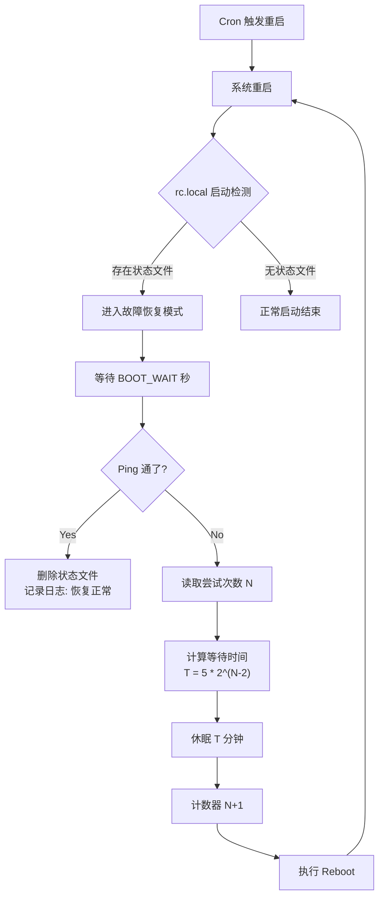

# OpenWrt 智能重启 & 断网自救脚本

这是一个专为 OpenWrt 路由器设计的自动化运维脚本。它结合了 **Cron 计划任务** 和 **开机网络检测**，实现“计划内重启”与“故障后自动重试”的完美闭环。

## 🎯 核心功能

- **📅 计划重启**：按照设定的 Cron 表达式（默认每天凌晨 4:00）执行定期重启，释放内存。
- **🛡️ 断网自救**：重启后自动检测网络（Ping）。如果网络未恢复，脚本会接管系统，进入“重试模式”。
- **📈 指数退避算法**：为避免频繁重启导致被运营商封禁或系统不稳定，重试间隔采用指数递增策略：
  - 第1次失败：立即重启
  - 第2次失败：等待 5分钟
  - 第3次失败：等待 10分钟
  - 第4次失败：等待 20分钟
  - ...以此类推（最大等待时间可控）。
- **💾 状态持久化**：重试计数器保存在非易失存储中，路由器掉电或重启后不会丢失当前的重试进度。
- **⚡ 冲突规避**：脚本逻辑将 Cron 触发与开机自检解耦，确保计划任务不会打断正在进行的故障恢复流程。
- **📦 一键管理**：提供交互式菜单，支持一键安装、更新、卸载及日志清理。

## 📂 文件说明

| **文件名**        | **说明**                                                     |
| ----------------- | ------------------------------------------------------------ |
| `smart_reboot.sh` | **核心逻辑脚本**。负责网络检测、计算等待时间、执行重启。     |
| `manage.sh`       | **管理工具**。提供交互式菜单，用于安装（配置 rc.local/crontab）和卸载。 |

## 🚀 快速开始

### 1. 上传脚本

通过 SSH 登录 OpenWrt，将 `smart_reboot.sh` 和 `manage.sh` 放入同一个目录（例如 `/root/`）。

### 2. (可选) 自定义配置

在安装前，你可以编辑文件修改默认设置：

- **修改重启时间**：编辑 `manage.sh`

  Bash

  ```
  CRON_TIME="0 4 * * *"  # 修改为你想要的 Cron 表达式
  ```

- **修改检测目标/超时**：编辑 `smart_reboot.sh`

  Bash

  ```
  TARGET_IP="223.5.5.5"   # 目标 IP (建议为网关或稳定 DNS)
  BOOT_WAIT=60            # 开机后等待多久开始检测 (秒)
  ```

### 3. 执行安装

赋予管理脚本执行权限并运行：

Bash

```
chmod +x manage.sh
./manage.sh
```

在菜单中选择 **`1`** 进行安装。脚本会自动：

1. 赋予核心脚本执行权限。
2. 配置 `/etc/rc.local` 实现开机自检。
3. 配置 Crontab 添加计划任务。

## 📝 查看日志

脚本运行日志分为两部分：

1. **实时状态 (RAM)**：

   Bash

   ```
   cat /tmp/smart_reboot.log
   # 或
   logread | grep "SmartReboot"
   ```

2. 历史记录 (Flash)：

   由于重启会清空 /tmp，为了排查昨晚重启了几次，脚本会将重要节点写入持久化日志：

   Bash

   ```
   cat /root/smart_reboot_history.log
   ```

## 🗑️ 卸载与清理

如果不再需要该功能，只需运行管理脚本：

Bash

```
./manage.sh
```

在菜单中选择 **`2`** 进行卸载。脚本会自动：

1. 从 `/etc/rc.local` 移除启动项。
2. 从 Crontab 移除计划任务。
3. 清理状态计数文件。
4. (可选) 询问是否删除历史日志文件。

## ⚙️ 工作逻辑图解

代码段



------

**注意**：请确保 `TARGET_IP` 是一个长期稳定的 IP 地址，以免因目标 IP 宕机导致路由器无限循环重启。建议使用阿里云 DNS (223.5.5.5) 或 Google DNS (8.8.8.8)。